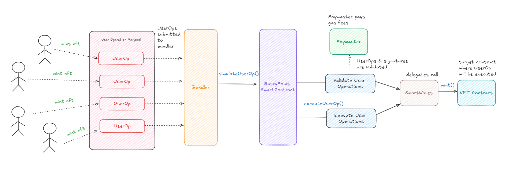

# Keyless, Gasless NFT Minting on Taiko

Mint an NFT for free using Account Abstraction (AA) on Taiko.

## Overview

This project enables users to mint NFTs using Account Abstraction with ERC-721, bypassing traditional transaction requirements. By leveraging the UserOperation (UserOp) mechanism, the process removes the need for users to directly sign transactions and pay gas fees, making the experience keyless and gasless.

## How It Works

### Flow of the UserOperation (UserOp) for the `mint()` Function

1. **User Action**  
   The user initiates an NFT minting by interacting with a DApp or clicking a "Mint NFT" button. Rather than creating a typical Ethereum transaction, the user generates a UserOperation (UserOp).

2. **UserOperation Creation**  
   The user's smart contract wallet (not an Externally Owned Account or EOA) generates a UserOp, which includes:
    - **sender**: The smart wallet address.
    - **nonce**: Ensures transaction uniqueness.
    - **initCode**: Wallet creation or initialization code (if needed).
    - **callData**: Encoded data representing the `mint()` function call.
    - **verificationGasLimit**: The gas needed for signature and validation.
    - **paymasterAndData**: (if using a Paymaster) Information on how gas fees will be paid.
    - **signature**: The user's cryptographic signature verifying the UserOp.

3. **Bundler Receives UserOperation**  
   The UserOperation is sent to a Bundler service, a specialized node that collects UserOps and submits them to the blockchain as part of a single batch transaction, optimizing gas fees and block space.

4. **UserOperation Verification**  
   The Bundler submits the UserOp to the `EntryPoint` contract, which handles account abstraction logic by:
    - Verifying the UserOp's validity, including gas limits, nonce, and signature correctness.
    - Checking if a Paymaster will cover gas fees or if the wallet itself will pay.
    - Executing the `validateUserOp` function in the user's smart wallet to validate the user's signature.

5. **Execution of the `mint()` Function**  
   Once verified, the `EntryPoint` contract calls the user’s wallet to execute the `mint()` function. The wallet sends this transaction to the NFT contract, minting the NFT to the specified address.

6. **Gas Payment via Paymaster (Optional)**  
   If a Paymaster is used, it handles the gas fees, enabling gasless transactions for the user by covering the cost.

7. **Bundler Submits Transaction**  
   The Bundler packages the UserOps and submits the transaction to the blockchain. Once confirmed, the minting process is complete, and the NFT is transferred to the user’s wallet.

## Benefits of Using Account Abstraction for ERC-721 Minting

- **Gasless Transactions (via Paymasters)**: Users can mint NFTs without holding ETH for gas, enhancing the user experience.
- **Efficient and Scalable**: Multiple UserOps can be processed in a single transaction, optimizing for lower fees and block space utilization.
- **Enhanced Security**: Smart wallets provide a flexible and secure method of interacting with the blockchain without exposing private keys.

---

This setup allows seamless and cost-effective NFT minting on Taiko using Account Abstraction.
